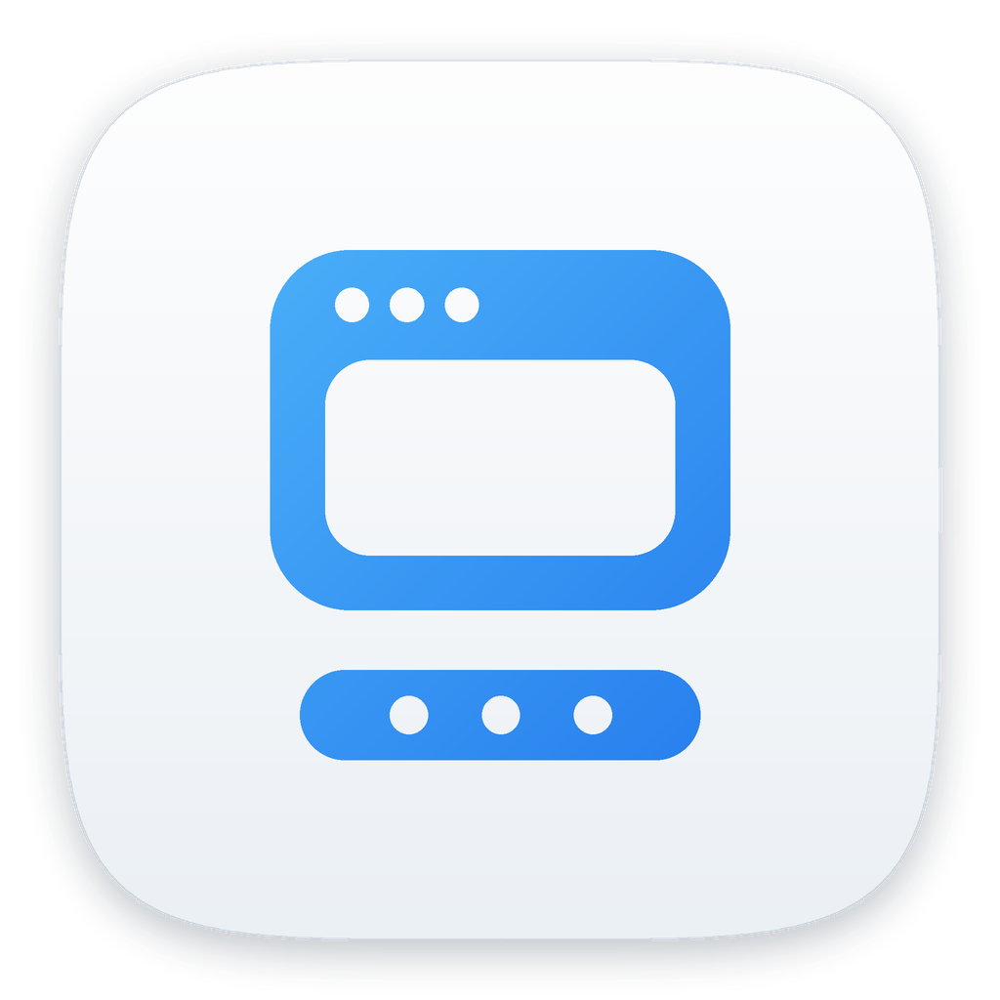
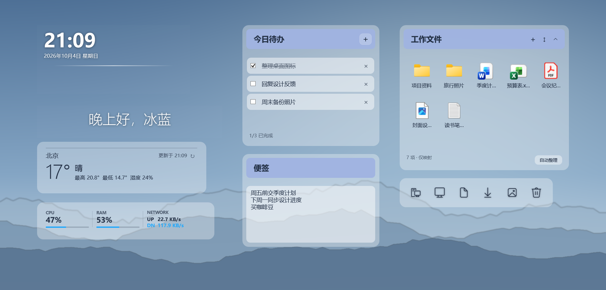

<div align="center">



# 冰蓝桌面

[下载](https://github.com/keros68/binglan/releases/latest) · [快速开始](#快速开始) · [使用说明](docs/USER-GUIDE.md) · [开发说明](docs/DEVELOPMENT.md) · [许可证](#许可证)

**在一个应用里管理 Windows 11 桌面上的信息卡片、待办、文件分组、Dock 和任务栏。**

</div>

冰蓝桌面是基于 .NET 10 与 WPF 的 Windows 11 桌面伴侣，替代原先分别用于桌面信息、文件收纳、Dock 和任务栏美化的多个工具。所有模块共用一个进程、一个托盘图标和一个设置中心。

<p align="center">
  
</p>

## 功能

- **桌面信息**：时间日期、问候语、天气、CPU / RAM / 网络各为独立卡片，可分别调整字体、字号、颜色和位置；时间下方可加两端渐隐的细线。
- **待办与便签**：待办卡片默认三条空白项，勾选、新增、删除互不干扰；普通便签支持多行文字和排版。
- **分组盒**：把桌面上的文件、文件夹和软件映射进盒子，按类型自动整理，可折叠成一条标题栏。分组盒只记录路径，原文件位置不变。
- **快捷入口**：一排线条图标，默认是此电脑、桌面、文档、下载、图片、回收站；图标、名称和打开位置均可自定义，位置可以是文件夹、程序或文件。
- **冰蓝 Dock**：固定应用与运行中的应用分区显示，有新消息的应用带提醒标记；拖动程序或快捷方式到 Dock 即可固定，颜色、透明度和图标大小可调。
- **任务栏**：保持默认或智能隐藏，可设为只在屏幕左下角、右下角唤出。
- **外观**：浅色玻璃、深色玻璃、无底板三种材质，文字色与强调色可自定义，内置开源字体；可从 Rainmeter 皮肤只读导入字体和配色。主题可导出分享，导出内容不含称呼、城市、待办和文件路径。

## 快速开始

1. 打开 [Releases](https://github.com/keros68/binglan/releases/latest)，下载 `BingLan-Setup-*.exe`。
2. 运行安装包。按当前用户安装，不需要管理员权限，自带 .NET 运行时。安装包尚未加入代码签名，首次运行需按 Windows 提示手动放行。
3. 首次启动后按引导选择布局和常用应用。之后可从托盘图标或卡片右键菜单打开设置中心。

系统要求：Windows 11 x64。各模块的详细用法见[使用说明](docs/USER-GUIDE.md)。

## 隐私

- 不采集遥测；待办、便签、文件路径、应用列表和窗口标题只保存在本机 `%LOCALAPPDATA%\BingLanWidgets`。
- 天气城市由用户手动搜索选择，网络请求只发送搜索关键词和所选城市的坐标，不使用 IP 或设备位置。
- 分组盒的添加、排序和移除只改变映射，不移动、重命名或删除原文件。

## 从源码构建

依赖 .NET 10 SDK、PowerShell 7；打安装包另需 Inno Setup 6 和 Visual Studio 2022 C++ 生成工具。

```powershell
dotnet build .\BingLan.slnx -c Release
dotnet run --project .\tests\BingLan.SmokeTests\BingLan.SmokeTests.csproj -c Release
pwsh -NoProfile -File .\installer\build.ps1 -Version 0.2.0
```

完整测试命令、技术方案和当前实现见[开发说明](docs/DEVELOPMENT.md)，安装包细节见[安装包](docs/INSTALLER.md)。

## 许可证

[PolyForm Noncommercial 1.0.0](LICENSE)，Copyright © 2026 keros68。可用于个人学习、研究和其他非商业用途；商业使用需另行取得授权。内置字体和其他第三方内容的许可见 [NOTICE](NOTICE.md)。
