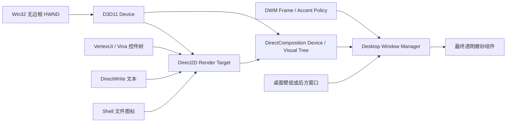

# Pogget 透明桌面组件技术拆解与复用实现方案

> 文档目的：拆解 Pogget 当前安装版本的透明桌面组件技术路线，并给出可在另一个 Windows 项目中复用的工程方案。  
> 分析对象：Pogget 1.0.0.0，Windows 11，125% DPI，单显示器。  
> 分析日期：2026-07-30。

## 1. 结论先行

Pogget 的透明效果不是一张半透明 PNG，也不是 WPF `AllowsTransparency=True` 形成的传统分层窗口。

从运行时窗口属性、EXE 导入、PDB 符号和本地 `.vina` 配置可以确认，它采用的是：

1. C++ / Win32 创建无边框顶层工具窗口；
2. D3D11 提供 GPU 设备；
3. DirectComposition 参与窗口内容合成；
4. Direct2D 绘制背景、圆角、图标和控件；
5. DirectWrite 绘制文字；
6. DWM 和 `SetWindowCompositionAttribute` 提供窗口后方材质或模糊；
7. 自研 `VertexUI / VinaWindow` 控件系统负责布局、输入和动画；
8. Shell API 获取系统文件图标；
9. OLE Drag & Drop 接收文件拖放；
10. `.vina` 文件保存容器、材质、布局和用户状态。

最重要的工程判断是：

- 当前可见的 Pogget 收纳盒 **没有** `WS_EX_LAYERED`；
- 它也没有启用 Windows 11 的系统 Mica/Acrylic `DWMWA_SYSTEMBACKDROP_TYPE`；
- 因此其透明材质主要来自自定义 D3D11/DirectComposition 内容与 DWM Accent/Blur 合成；
- 若要获得同等级的稳定性和视觉质量，首选原生 Win32 渲染宿主，避免将整个窗口做成 WPF Layered Window。

## 2. 证据等级

本文使用三种标记：

| 标记 | 含义 |
|---|---|
| **已确认** | 来自运行时窗口探测、安装包、配置文件、EXE 导入或 PDB 符号 |
| **强推断** | 多项证据一致，但没有 Pogget GUI 源码可以逐行核对 |
| **建议实现** | 针对新项目给出的稳定实现，不声明 Pogget 内部完全相同 |

公开仓库 `EnderMo/PoggetCore` 只包含 Core/Storage 等基础逻辑，不包含 `VertexUI`、`VinaWindow` 和桌面容器 GUI 源码。因此本文不是源码泄露或反编译还原，而是基于合法的本机运行时和公开二进制接口进行工程级拆解。

## 3. 技术栈全景

### 3.1 已确认的原生依赖

Pogget.exe 导入或动态引用了：

| 层 | 技术 | 用途 |
|---|---|---|
| 窗口 | USER32 | HWND、消息循环、鼠标、窗口位置、父子关系 |
| 桌面层 | `SetParent`、`SetWindowPos` | 可选的桌面嵌入与 Z 序管理 |
| DWM | `dwmapi.dll` | 窗口合成、Frame 扩展、属性与刷新 |
| 材质 | `SetWindowCompositionAttribute` | Accent/Blur/Acrylic 类背景策略 |
| GPU | `d3d11.dll` | D3D11 设备与 GPU 合成基础 |
| 合成 | `dcomp.dll` | DirectComposition Visual 树 |
| 2D 绘制 | `d2d1.dll` | 圆角、矩形、图片、阴影等 |
| 字体 | `DWrite.dll` | Segoe UI 文本布局与抗锯齿 |
| 辅助绘制 | `gdiplus.dll` | 位图或兼容性绘制 |
| 文件图标 | SHELL32、`SHGetFileInfoW` | 系统文件类型图标 |
| 拖放 | OLE32、`RegisterDragDrop` | Explorer 文件拖入 |
| 输入法 | IMM32 | 中文输入 |
| 控件/外壳 | COMCTL32、SHLWAPI | 系统组件与路径辅助 |
| 编译器 | MSVC Runtime | 原生 C++ 运行库 |

### 3.2 PDB 中确认的内部结构

官方 PDB 包含以下符号：

- `VertexUI`
- `VinaWindow`
- `VertexUI::D2DVertexUIPanel`
- `PoggetDesktopContainer::CreateCom`
- `PoggetDesktopContainer::EmbedWindowToDesktop`
- `PoggetDesktopContainer::RemoveRuntimeContainerWindow`
- `PoggetDesktopContainer::VinaIconManager`
- `VinaIconManager::LayoutIcons`
- `VinaIconManager::ApplyCurrentPositions`
- `VinaIconManager::UpdateAnimations`
- `PoggetDesktopContainer::VinaIcon`
- `VinaIcon::CreateCtl`
- `VinaIcon::OnMouseDown`
- `VinaIcon::PlayRightClickAnimation`
- `VinaSectionHeader`
- `VinaSectionHeaderCtl`
- `VinaScrollBar`
- `VinaFloatTip`
- `VinaGroupTag`
- `VinaCheckBox`
- `VinaButton`
- `VinaMenu`
- `VinaCaptionBar`
- `DrawAnimatedTextWithBlurShadow`

多处函数签名包含 `ID2D1HwndRenderTarget`。这说明其 GUI 不是 Win32 子控件堆叠，而是一个 HWND 内部由 Direct2D 绘制的自定义控件树。

## 4. 官方窗口模型

### 4.1 运行时实测

当前可见收纳盒窗口：

| 属性 | 实测值 | 含义 |
|---|---:|---|
| Window Class | `Pogget.Vina.Com.Container.Class.5d732` | 自定义原生窗口类 |
| Style | `0x16020000` | 可见、裁剪子项/兄弟项、无系统标题栏 |
| ExStyle | `0x00000090` | `WS_EX_TOOLWINDOW + WS_EX_ACCEPTFILES` |
| Parent | `0` | 当前是独立顶层窗口 |
| `WS_EX_LAYERED` | 否 | 不是传统 Layered Window |
| `WS_EX_TRANSPARENT` | 否 | 不穿透鼠标 |
| `WS_EX_NOACTIVATE` | 否 | 可接收点击和键盘焦点 |
| `WS_CHILD` | 否 | 当前不是 WorkerW 子窗口 |
| DPI | 120 | 125% 缩放 |
| DWM Composition | 开启 | 由桌面窗口管理器合成 |
| `DWMWA_SYSTEMBACKDROP_TYPE` | 0 | 未使用系统 Mica/Acrylic 类型 |
| `DWMWA_WINDOW_CORNER_PREFERENCE` | 0 | 未依赖系统圆角 |
| Visible frame border | 1 px | DWM 可见边框度量 |

`0x90` 的两个关键位：

```text
0x80  WS_EX_TOOLWINDOW   不出现在任务栏和 Alt+Tab 主窗口列表中
0x10  WS_EX_ACCEPTFILES  接受 Shell 文件拖放
```

### 4.2 为什么不是 `AllowsTransparency`

WPF 的 `AllowsTransparency=True` 会令窗口使用 `WS_EX_LAYERED`。这种方案：

- 整窗经 CPU/软件路径更新时容易产生性能损失；
- DWM 原生模糊和透明背景组合受限；
- 子窗口、视频、WebView、输入法和阴影容易出现兼容问题；
- 大面积动态内容时更容易卡顿；
- 某些显卡和远程桌面环境下表现不稳定。

Pogget 当前窗口不存在 `WS_EX_LAYERED`，因此它保留普通 HWND 的可靠输入和焦点行为，把透明交给 DWM/DirectComposition 合成。

## 5. 渲染与透明材质链路



### 5.1 已确认部分

- 创建 D3D11 设备：`D3D11CreateDevice`
- 创建 DirectComposition 设备：`DCompositionCreateDevice`
- 创建 DirectWrite 工厂：`DWriteCreateFactory`
- 使用 Direct2D HWND RenderTarget
- 调用 `DwmExtendFrameIntoClientArea`
- 调用 `DwmSetWindowAttribute`
- 调用 `SetWindowCompositionAttribute`
- 调用 `DwmFlush`

### 5.2 强推断的合成方式

综合以下事实：

1. 窗口没有 `WS_EX_LAYERED`；
2. Windows 11 System Backdrop 类型为 0；
3. 配置启用了 `EnableDynamicMaterialLayerForD3D11=true`；
4. EXE 同时使用 D3D11、DirectComposition、DWM 和 `SetWindowCompositionAttribute`；
5. 壁纸可透过窗口，背景具有实时柔化和着色；

最合理的实现链路是：

1. 将客户区扩展为 DWM 可合成区域；
2. 使用 Accent Policy 或等价方式启用窗口后方模糊；
3. D3D11/DirectComposition 绘制带透明度的动态材质层；
4. Direct2D 在其上绘制圆角底色、标题栏、图标和文字；
5. 阴影可能由自绘层和 DWM 阴影共同完成。

无法从现有证据确认其 Accent State 的具体枚举值，因此不应声称一定是 `ACCENT_ENABLE_ACRYLICBLURBEHIND`。这一点要通过 API Hook 或 GUI 源码才能最终确认。

### 5.3 透明效果的三个组成部分

透明设计不是一个 `Opacity` 参数，而是三层叠加：

#### A. 背景透出

后方壁纸或窗口内容能够通过客户区显示。

#### B. 背景模糊

透出的内容被低通滤波，避免文字被复杂壁纸干扰。

#### C. 半透明着色

在模糊结果上叠加白色或主题色：

```text
FinalColor = BackdropBlur × (1 - TintAlpha) + TintColor × TintAlpha
```

Pogget 的视觉柔和感主要来自 B 和 C，而不是简单降低整个窗口的 Opacity。

## 6. 官方视觉参数

参数来自用户本地运行时 `.vina` 配置。个人文件路径未写入本文。

### 6.1 全局默认值

| 参数 | 值 | 作用 |
|---|---:|---|
| `themeBaseColor` | `#FFFFFF` | 浅色主题基色 |
| `bgAlpha` | `0.37` | 主背景着色透明度 |
| `titleAlpha` | `0.44` | 标题栏默认透明度 |
| `TransparentFrameMode` | `1` | 默认透明框架模式 |
| `shadowBlur` | `16.32` | 阴影模糊半径 |
| `shadowAlpha` | `0.26` | 阴影透明度 |
| `shadowOffsetX` | `0.64` | 水平偏移 |
| `shadowOffsetY` | `5.12` | 垂直偏移 |
| `cornerRad` | `15.5` | 外框圆角 |
| `fontFamily` | `Segoe UI` | 默认字体 |
| `textSize` | `10` | 默认字号 |

### 6.2 当前截图对应容器

| 参数 | 值 | 作用 |
|---|---:|---|
| `cx` | `353` | 保存的容器宽度 |
| `cy` | `444` | 保存的容器高度 |
| `base_w` | `2560` | 保存时基准屏幕宽 |
| `base_h` | `1440` | 保存时基准屏幕高 |
| `bgAlpha` | `0.32` | 当前主背景透明度 |
| `titleAlpha` | `0.97` | 当前标题栏接近不透明 |
| `clrtag` | `#A0B4E1` | 冰蓝紫标题色 |
| `TransparentFrameMode` | `3` | 当前材质模式 |
| `CompatibleLayer` | `4` | 当前兼容层 |
| `cornerRad` | `9.2` | 标题/标签圆角 |
| `shadowBlur` | `20.16` | 当前阴影模糊半径 |
| `shadowAlpha` | `0.26` | 当前阴影透明度 |
| `shadowOffsetY` | `5.12` | 阴影下移 |
| `IsListView` | `false` | 使用图标网格 |
| `IsLocked` | `false` | 组件未锁定 |
| `QuickExpandCollapse` | `1` | 启用快速折叠 |
| `AutoHideTitleBar` | `0` | 标题栏常显 |
| Dynamic D3D11 material | `true` | 动态材质启用 |
| Static D3D11 material | `false` | 静态材质关闭 |

### 6.3 从截图测得的布局

| 项目 | 约值 |
|---|---:|
| 外框 | 353 × 444 px |
| 外框圆角 | 15–16 px |
| 标题栏外边距 | 10 px |
| 标题栏高度 | 50 px |
| 标题左边距 | 19 px（相对标题栏） |
| 网格列数 | 4 |
| 每列宽度 | 约 75 px |
| 文件图标 | 约 43 × 43 px |
| 单项垂直占用 | 约 92 px |

截图像素色不能直接当成源颜色，因为它已经包含壁纸、模糊、透明着色和屏幕截图色彩管理。应优先使用 `.vina` 中的 `#A0B4E1` 和 Alpha 参数。

## 7. 自定义控件系统

Pogget 没有给每个按钮、标题、文件项创建独立 HWND。其结构更像：

```text
Container HWND
└─ D2DVertexUIPanel
   ├─ VinaSectionHeaderCtl
   │  ├─ Title
   │  ├─ Menu button
   │  └─ Collapse button
   ├─ VinaIconManager
   │  ├─ VinaIcon
   │  ├─ VinaIcon
   │  └─ ...
   ├─ VinaScrollBar
   ├─ VinaFloatTip
   └─ VinaMenu
```

这一设计有四个优点：

1. 所有内容都能进入同一个 D2D/DComp 透明合成面；
2. 圆角裁剪、透明度和动画保持一致；
3. 文件网格不受 Win32 子窗口透明限制；
4. 命中测试、拖动和选中状态可以统一管理。

代价是需要自己实现：

- 控件树；
- 布局；
- 鼠标捕获；
- 键盘焦点；
- 中文输入；
- 无障碍；
- 文本选择；
- 滚动；
- 动画时钟。

另一个项目若只是复用透明外观，不需要照搬整个自研 UI 框架。

## 8. 文件图标与拖放

### 8.1 文件图标

Pogget 导入 `SHGetFileInfoW`，因此图标大概率来自 Windows Shell：

```cpp
SHFILEINFOW info{};
SHGetFileInfoW(
    path.c_str(),
    FILE_ATTRIBUTE_NORMAL,
    &info,
    sizeof(info),
    SHGFI_ICON | SHGFI_LARGEICON | SHGFI_USEFILEATTRIBUTES);
```

实现时还需要：

- 用 `IShellItemImageFactory` 获取更高清的缩略图；
- 缓存扩展名图标；
- 文件夹按真实路径取图标；
- 及时 `DestroyIcon`；
- 图标缓存放在 UI 线程之外加载，完成后回到 UI 线程提交纹理。

### 8.2 文件拖放

Pogget 同时具备：

- `WS_EX_ACCEPTFILES`
- `RegisterDragDrop`
- OLE32

说明它至少支持 OLE `IDropTarget`，而不是只依赖简单的 `WM_DROPFILES`。

推荐使用 OLE Drag & Drop：

```cpp
OleInitialize(nullptr);
RegisterDragDrop(hwnd, dropTarget);
```

它可以提供：

- 拖入过程中的进入/移动/离开反馈；
- 文件列表 `CF_HDROP`；
- 复制、链接、移动的视觉光标；
- 更稳定的 Explorer 集成。

映射模式只记录绝对路径，不移动源文件。应在模型层明确禁止调用 `MoveFile`。

## 9. 拖动、点击和调整大小

### 9.1 不要把整个窗口做成点击穿透

官方窗口没有 `WS_EX_TRANSPARENT`，这是正确的。桌面组件需要同时满足：

- 空白区可拖动；
- 图标可双击；
- 标题按钮可点击；
- 文件可拖入；
- 文本可编辑；
- 边缘可缩放。

全局点击穿透会破坏这些行为。

### 9.2 推荐命中测试顺序

```text
1. 缩放边缘/角
2. 标题栏按钮
3. 文件图标或待办项目
4. 可编辑文本
5. 其余未锁定区域 -> 拖动窗口
6. 锁定状态下的空白区 -> 普通客户区
```

可在 `WM_NCHITTEST` 中返回：

```cpp
HTTOPLEFT / HTTOP / HTTOPRIGHT
HTLEFT / HTRIGHT
HTBOTTOMLEFT / HTBOTTOM / HTBOTTOMRIGHT
HTCAPTION
HTCLIENT
```

关键规则：

```cpp
if (!locked && hitTarget == EmptyBackground)
    return HTCAPTION;
```

这能保证“未锁定时直接拖动整个收纳盒”，同时不抢占按钮和图标的点击。

### 9.3 为什么比手写 MouseMove 更稳

返回 `HTCAPTION` 或发送 `WM_NCLBUTTONDOWN/HTCAPTION` 后：

- 系统负责捕获鼠标；
- 快速移动不丢失拖动；
- 跨窗口边界仍连续；
- Windows 自己处理 DPI 和桌面边缘；
- 不需要高频修改坐标；
- 触控笔和部分辅助输入更兼容。

若需要拖动中动画，再监听 `WM_MOVING`，不要替代系统拖动循环。

## 10. 桌面层与 Z 序

PDB 中存在 `EmbedWindowToDesktop`，EXE 也导入 `SetParent`，说明 Pogget具备嵌入桌面层的能力。

但本次运行时可见容器：

```text
Parent = 0
WS_CHILD = false
```

因此“始终作为 WorkerW 子窗口”并不成立。更可能是：

- 桌面嵌入是可选模式；
- 某些兼容层使用独立顶层窗口；
- Explorer 重启后会重新选择策略；
- 当前透明模式 3 / 兼容层 4 使用顶层 ToolWindow。

### 10.1 推荐策略

默认采用独立顶层 `WS_EX_TOOLWINDOW`：

- 不显示任务栏按钮；
- 不污染 Alt+Tab；
- 可可靠获得焦点和拖放；
- 不依赖 Explorer 私有窗口结构；
- 通过 Z 序管理保持在普通窗口后方或桌面上方。

只有确实要求“显示桌面时永不隐藏”或“严格处于图标层”时，再实现 WorkerW 兼容模块。

### 10.2 WorkerW 风险

常见做法会向 `Progman` 发送未公开消息 `0x052C`，再枚举 `WorkerW`。该方案存在：

- Windows 更新后窗口树变化；
- Explorer 重启导致父窗口失效；
- 多显示器 WorkerW 不唯一；
- 桌面图标层前后顺序难以保证；
- `SetParent` 会改变 DPI Awareness 行为；
- 焦点、IME、拖放和右键菜单更复杂。

因此应把桌面嵌入封装成可关闭的兼容层，而不是透明窗体的必要条件。

## 11. 配置与持久化

Pogget 使用 `.vina` 文件保存：

- 窗口位置和大小；
- 基准屏幕分辨率；
- 透明模式；
- 背景和标题 Alpha；
- 主题色；
- 圆角和阴影；
- 字体；
- 网格模式；
- 锁定状态；
- 展开/折叠状态；
- 文件映射；
- 功能开关。

### 11.1 新项目推荐数据结构

```json
{
  "schemaVersion": 1,
  "widgets": [
    {
      "id": "guid",
      "type": "fileBox",
      "title": "近日待办",
      "boundsDip": { "x": 40, "y": 36, "width": 353, "height": 444 },
      "monitorId": "\\\\.\\DISPLAY1",
      "savedDpi": 120,
      "locked": false,
      "collapsed": false,
      "appearance": {
        "tint": "#A0B4E1",
        "backgroundAlpha": 0.32,
        "titleAlpha": 0.97,
        "outerRadius": 15.5,
        "headerRadius": 9.2,
        "shadowBlur": 20.16,
        "shadowAlpha": 0.26
      },
      "items": []
    }
  ]
}
```

建议保存 DIP，而不是物理像素。恢复时：

1. 读取显示器和 DPI；
2. 若原显示器不存在，迁移到主显示器工作区；
3. 限制窗口至少有标题栏留在屏幕内；
4. 以临时文件写入；
5. `FlushFileBuffers` 后原子替换正式文件；
6. 保留一个 `.bak`。

推荐目录：

```text
%LocalAppData%\Vendor\Product\
├─ state.json
├─ state.json.bak
├─ logs\
└─ cache\icons\
```

## 12. 推荐的可复用实现路线

### 12.1 路线 A：C++ / Win32 / D2D / DComp

**视觉还原度：最高**  
**工程成本：最高**  
**适合：透明桌面组件是产品核心能力**

组成：

- C++20
- Win32 HWND
- D3D11
- DirectComposition
- Direct2D 1.1
- DirectWrite
- WIC
- DWM
- OLE Drag & Drop
- Windows Shell API

优点：

- 最接近 Pogget；
- 输入、拖放和窗口管理最可控；
- 动画和透明合成都在 GPU；
- 无 WPF Layered Window 限制；
- 可以做完整自定义材质。

缺点：

- 文本编辑、IME、无障碍成本高；
- 需要处理设备丢失；
- UI 开发速度慢；
- 渲染生命周期复杂。

### 12.2 路线 B：WPF + 原生 HWND 材质桥

**视觉还原度：中高**  
**工程成本：中**  
**适合：现有业务已经是 .NET/WPF**

关键限制：

```xml
AllowsTransparency="False"
WindowStyle="None"
ResizeMode="NoResize"
ShowInTaskbar="False"
```

然后通过 `HwndSource`：

- 调用 DWM/Accent API；
- 扩展 Frame；
- 设置 ToolWindow；
- 处理 `WM_NCHITTEST`；
- 处理 DPI；
- 使用 WPF 绘制前景内容。

不要再设置 `AllowsTransparency=True`。否则会重新进入 `WS_EX_LAYERED`。

这条路线足以实现：

- 稳定拖动；
- 真实背景模糊；
- WPF 文本编辑和中文输入；
- 待办列表；
- 文件网格；
- 本地 JSON；
- 边缘缩放。

它不适合在透明区域内放复杂的子 HWND 内容，例如老式 WebBrowser 或某些视频控件。

### 12.3 路线 C：WinUI 3 + Windows App SDK

**视觉还原度：中高**  
**工程成本：中高**  
**适合：全新项目、希望使用官方 Backdrop API**

可使用：

- `DesktopAcrylicBackdrop`
- `MicaBackdrop`
- `AppWindow`
- Windows Composition

优点：

- Windows 11 官方材质；
- DPI、输入和现代控件较完整；
- 比自研 D2D 控件快。

缺点：

- 官方 Acrylic 视觉不等于 Pogget 的定制材质；
- 桌面工具窗口和 Z 序仍需 Win32；
- 打包、启动速度和运行时体积高于纯 Win32；
- Windows App SDK 版本变化需要维护。

## 13. 两个项目的建议选择

### BingLan 当前项目

建议保留 WPF 业务层，但替换透明窗口实现：

1. `AllowsTransparency=False`；
2. 每个组件仍是独立 WPF Window；
3. 使用 Win32 设置无边框 ToolWindow；
4. DWM/Accent 提供背景模糊；
5. WPF 仅绘制标题、待办、文件网格；
6. `WM_NCHITTEST` 统一拖动和缩放；
7. 等交互稳定后再加入 D3D11 动态材质。

这是改动量与稳定性最平衡的方案。

### 另一个需要复用透明设计的项目

- 若只是“磨砂面板 + 普通表单/列表”：使用路线 B 或 WinUI 3；
- 若透明桌面组件本身是核心产品能力：使用路线 A；
- 不建议为一次视觉效果单独自研 VertexUI 等完整控件系统；
- 建议把原生透明宿主封装成独立 `WidgetHost` 模块，业务 UI 与材质层解耦。

## 14. 推荐模块边界

```text
WidgetHost.Native
├─ NativeWindow
├─ WindowStyles
├─ HitTestController
├─ DesktopLayerController
├─ DpiController
├─ BackdropController
├─ D3DDeviceManager
└─ ExplorerRestartObserver

WidgetHost.Rendering
├─ MaterialParameters
├─ ShadowRenderer
├─ RoundedClip
└─ DeviceLostRecovery

WidgetHost.Shell
├─ ShellIconProvider
├─ OleDropTarget
├─ FileLauncher
└─ ContextMenuAdapter

Product.UI
├─ TodoWidget
├─ FileBoxWidget
└─ Settings

Product.Persistence
├─ StateStore
├─ AtomicBackup
└─ SchemaMigration
```

透明、桌面层、拖动和 DPI 都不应散落在业务组件代码中。

## 15. 原生窗口创建参考

下面是推荐实现骨架，不是 Pogget 源码：

```cpp
DWORD style =
    WS_VISIBLE |
    WS_CLIPCHILDREN |
    WS_CLIPSIBLINGS;

DWORD exStyle =
    WS_EX_TOOLWINDOW |
    WS_EX_ACCEPTFILES;

HWND hwnd = CreateWindowExW(
    exStyle,
    L"Product.Widget.Container",
    L"",
    style,
    x, y, width, height,
    nullptr,
    nullptr,
    instance,
    widget);
```

创建完成后：

```cpp
MARGINS margins{-1};
DwmExtendFrameIntoClientArea(hwnd, &margins);

SetWindowPos(
    hwnd,
    nullptr,
    0, 0, 0, 0,
    SWP_NOMOVE |
    SWP_NOSIZE |
    SWP_NOZORDER |
    SWP_FRAMECHANGED |
    SWP_NOACTIVATE);
```

注意：

- 不添加 `WS_EX_LAYERED`；
- 不添加全局 `WS_EX_TRANSPARENT`；
- 需要键盘编辑时不添加 `WS_EX_NOACTIVATE`；
- 只有锁定并明确开启“鼠标穿透”时，才动态切换 `WS_EX_TRANSPARENT`；
- 不要通过整窗 `SetLayeredWindowAttributes` 实现磨砂。

## 16. D3D11 / DirectComposition 初始化顺序

```text
1. 创建 D3D11 Device，启用 BGRA Support
2. 获取 IDXGIDevice
3. 创建 D2D Factory 和 D2D Device
4. 创建 DirectComposition Device
5. 创建透明 SwapChain 或 D2D HWND RenderTarget
6. 创建 DComp Target 绑定 HWND
7. 创建根 Visual
8. 将内容 Surface/SwapChain 绑定 Visual
9. 设置裁剪、圆角和变换
10. Commit
```

关键设备标志：

```cpp
D3D11_CREATE_DEVICE_BGRA_SUPPORT
```

开发构建可追加：

```cpp
D3D11_CREATE_DEVICE_DEBUG
```

交换链透明模式应使用预乘 Alpha：

```text
DXGI_ALPHA_MODE_PREMULTIPLIED
```

绘制时所有颜色都应遵守预乘 Alpha，否则圆角边缘会出现黑边或白边。

## 17. 阴影与圆角

Pogget 的圆角不是系统 Window Corner，因为运行时：

```text
DWMWA_WINDOW_CORNER_PREFERENCE = DEFAULT
```

且配置中存在 `cornerRad`。因此圆角主要由内容裁剪/自绘形成。

推荐：

- 外圆角：15.5 DIP；
- 标题栏圆角：9.2 DIP；
- 阴影模糊：20.16 DIP；
- 阴影 Alpha：0.26；
- 阴影 Y 偏移：5.12 DIP；
- 阴影颜色使用低饱和深灰蓝，而非纯黑。

如果用 WPF：

- 小组件可以使用 `DropShadowEffect`；
- 多组件或大窗口时建议用独立 DComp 阴影视觉；
- 不要让阴影参与内容裁剪；
- 阴影边界需预留 20–30 DIP，否则窗口矩形会截断。

## 18. DPI 与坐标

本次运行时：

```text
GetDpiForWindow = 120
```

程序必须声明 Per-Monitor V2 DPI Awareness，并区分：

- DIP：业务布局、保存尺寸；
- 物理像素：D3D SwapChain、窗口最终矩形；
- 屏幕工作区：恢复位置；
- DWM 扩展边界：阴影和可见框。

必须处理：

- `WM_DPICHANGED`
- `GetDpiForWindow`
- `AdjustWindowRectExForDpi`
- `MonitorFromWindow`
- `GetMonitorInfo`

收到 `WM_DPICHANGED` 时优先采用消息提供的建议矩形，不要只缩放内部内容。

## 19. 设备丢失与降级

D3D/DComp 可能因显卡驱动重启、休眠、远程桌面切换而失效。

至少处理：

- `DXGI_ERROR_DEVICE_REMOVED`
- `DXGI_ERROR_DEVICE_RESET`
- SwapChain Resize 失败；
- DComp Commit 失败；
- Explorer 重启；
- DWM Composition 状态变化。

降级顺序建议：

```text
动态 D3D11 材质
    ↓ 失败
DWM/Accent 模糊 + 静态着色
    ↓ 失败
普通不透明浅色背景
```

不要让透明失败后出现黑色矩形。

## 20. 性能预算

桌面组件会长时间常驻，目标应是：

| 状态 | CPU | GPU | 刷新策略 |
|---|---:|---:|---|
| 静止 | 接近 0% | 接近 0% | 无持续重绘 |
| 悬停 | 低 | 低 | 仅脏矩形 |
| 拖动 | 可短时升高 | 可短时升高 | 60 Hz 上限 |
| 动画 | 低 | 低 | 16.67 ms 帧预算 |
| 后台被遮挡 | 接近 0% | 接近 0% | 暂停动画 |

禁止为了维持磨砂效果永久跑 60 FPS。DWM Backdrop 本身会处理后方变化，前景控件只在状态变化时重绘。

## 21. 兼容性与风险

| 风险 | 应对 |
|---|---|
| `SetWindowCompositionAttribute` 未公开 | 动态加载；提供 DWM/不透明降级 |
| WorkerW 是非公开桌面结构 | 独立兼容模块；Explorer 重启后重建 |
| 远程桌面禁用部分效果 | 自动关闭动画和模糊 |
| 节能模式降低合成能力 | 使用静态材质 |
| 高对比度主题 | 禁用透明，使用系统颜色 |
| 中文 IME | 编辑控件保留正常焦点，不使用全局 NoActivate |
| DPI 切换 | Per-Monitor V2 + WM_DPICHANGED |
| 截图/录屏透明异常 | 保留不透明模式供用户切换 |
| 显卡设备丢失 | 重建 D3D/DComp 资源 |

## 22. 验证清单

### 窗口

- [ ] 不出现在任务栏；
- [ ] 不出现在 Alt+Tab；
- [ ] 未锁定时空白区域均可拖动；
- [ ] 按钮、文件、待办不会误触发窗口拖动；
- [ ] 八方向缩放有效；
- [ ] 锁定后不能移动或缩放；
- [ ] 可选穿透只在锁定时启用。

### 材质

- [ ] 不使用 `WS_EX_LAYERED`；
- [ ] 复杂壁纸上文字仍清晰；
- [ ] 圆角边缘无黑边/白边；
- [ ] 阴影不被窗口矩形裁切；
- [ ] DWM/显卡异常时不出现黑色背景；
- [ ] 关闭透明后仍可用。

### DPI/显示器

- [ ] 100%、125%、150%、175%、200%；
- [ ] 从一个 DPI 的显示器拖到另一个；
- [ ] 拔掉保存位置所在显示器；
- [ ] 重启后组件回到可见工作区；
- [ ] Explorer 重启后层级恢复。

### 输入

- [ ] 单击、双击、右击；
- [ ] 中文输入法；
- [ ] Explorer 文件拖放；
- [ ] 快速拖动不丢鼠标；
- [ ] 鼠标按下后移出窗口仍能完成操作；
- [ ] 触摸板和高精度鼠标。

### 持久化

- [ ] 崩溃时不损坏正式状态文件；
- [ ] `.bak` 可恢复；
- [ ] 映射模式不移动源文件；
- [ ] 源文件不存在时显示失效状态，不自动删除记录；
- [ ] Schema 升级有迁移测试。

## 23. 不建议采用的方案

### 23.1 WPF 整窗 `AllowsTransparency=True`

只适合小型、静态、无复杂交互的装饰窗，不适合作为本项目主方案。

### 23.2 定时截取壁纸再高斯模糊

它无法正确反映窗口后方内容，拖动时容易延迟，且多显示器和动态壁纸处理复杂。

### 23.3 全局设置 `Opacity`

会连文字、图标一起变淡，不是磨砂玻璃。

### 23.4 直接强制 WorkerW

透明与桌面层是两个问题。先做好普通顶层组件，再把桌面嵌入作为可选能力。

### 23.5 用 Emoji 或字符模拟工具栏图标

不同字体和 DPI 下外观不可控。应使用 Segoe Fluent Icons、系统 SymbolIcon 或真实矢量图标库。

## 24. 分阶段实施建议

### 阶段 1：稳定窗口宿主

完成：

- 普通无边框 ToolWindow；
- `AllowsTransparency=False`；
- `WM_NCHITTEST` 拖动与缩放；
- DPI；
- 位置恢复；
- 任务栏/Alt+Tab 行为。

验收：不启用任何透明效果时，窗口交互已完全稳定。

### 阶段 2：DWM 透明材质

完成：

- Frame 扩展；
- Accent/Backdrop；
- 半透明 Tint；
- 圆角裁剪；
- 阴影；
- 不透明降级。

验收：静态截图和拖动过程均无黑边、闪烁、残影。

### 阶段 3：业务 UI

完成：

- 待办编辑与勾选；
- 文件图标网格；
- OLE 文件拖放；
- 右键菜单；
- 标题编辑。

验收：所有输入目标与窗口拖动互不冲突。

### 阶段 4：桌面层

完成：

- Z 序策略；
- 显示桌面行为；
- 可选 WorkerW；
- Explorer 重启恢复。

验收：桌面层故障不会影响数据和普通顶层模式。

### 阶段 5：动态材质和动画

完成：

- D3D11 动态材质；
- DComp 动画；
- 设备丢失恢复；
- 节能和远程桌面降级。

验收：静止状态无持续重绘，休眠/唤醒和显卡重启可恢复。

## 25. 本次分析产物

- 官方视觉参数说明：[DESIGN-SPEC.md](DESIGN-SPEC.md)
- 静态视觉复刻项目：[Pogget.VisualStudy](Pogget.VisualStudy)
- 参考与复刻对照图：[reference-vs-clone.png](artifacts/reference-vs-clone.png)
- 官方 Core 源码副本：[PoggetCore](../upstream/PoggetCore)
- 官方安装包和符号文件：[official-build](../upstream/official-build)

## 26. 最终建议

如果目标是让 BingLan 和另一个项目都复用这套设计，不要复制一份透明窗口代码到两个项目。

应先做一个小型、无业务依赖的 `WidgetHost`：

```text
输入：HWND、材质参数、锁定状态
输出：透明材质、拖动/缩放、DPI、桌面层和降级能力
```

第一版以 WPF + Native HWND Bridge 验证交互和视觉；接口稳定后，如果动态材质和性能确实需要，再将渲染宿主替换为 C++ D3D11/DirectComposition。这样能保留当前 .NET 开发效率，同时避免把 WPF Layered Window 的限制带到两个项目中。

## 27. WidgetHost 实机原型结论

本轮已经按照第 26 节的边界完成隔离原型：

- 可复用宿主：[BingLan.WidgetHost.Wpf](BingLan.WidgetHost.Wpf)
- 两个真实调用方：[BingLan.WidgetHost.Sample](BingLan.WidgetHost.Sample)
- 真实 HWND 烟雾测试：[BingLan.WidgetHost.Tests](BingLan.WidgetHost.Tests)
- 运行与验证说明：[README.md](BingLan.WidgetHost.Sample/README.md)
- 视觉 QA：[design-qa.md](BingLan.WidgetHost.Sample/design-qa.md)

### 27.1 实机验证后修正的判断

文档化的 `DWMSBT_TRANSIENTWINDOW` 很稳定，但在当前 Windows 11 环境中，它的整体亮度和材质感比参考 Pogget 更厚，不适合作为“复刻外观”的唯一后端。

当前最接近参考图的 WPF 路线是：

```text
普通非 Layered HWND
  -> 客户区 SetWindowCompositionAttribute / ACCENT_ENABLE_BLURBEHIND
  -> WPF #52FFFFFF 半透明内容表面
  -> #F7A0B4E1 标题栏
  -> DWM 圆角和外部阴影
```

这里没有对整个窗口做 `DwmExtendFrameIntoClientArea(-1)`。实测全窗口 Frame 扩展会让 WPF 内容区出现过亮、发白或不透明的外观。PoggetLike 模式先清除旧 System Backdrop，再恢复客户区 Frame；两个 DWM 调用和 WCA 调用全部成功后才报告 `AccentBlur`，否则继续尝试文档化 System Backdrop，最后回退纯色。

### 27.2 非客户区和缩放的关键细节

只增加 `WS_THICKFRAME` 不够。Windows 会重新计算不可见非客户区，导致 WPF 根元素比窗口实际尺寸小，并出现顶部白条或边缘内缩。

最终顺序是：

1. 取得 `HwndSource`；
2. 先安装消息 Hook；
3. 设置普通窗口和扩展样式；
4. `SetWindowPos(... SWP_FRAMECHANGED)`；
5. 在 `WM_NCCALCSIZE` 中保留完整客户区；
6. 在 `WM_NCHITTEST` 中返回系统拖动/八方向缩放命中码。

Hook 必须先于 `SWP_FRAMECHANGED`，否则第一次非客户区计算仍走默认路径，窗口可能直到下次 Frame 变化才恢复正确尺寸。

### 27.3 稳定性边界

实机审查额外确认了以下不变量：

- `ShowActivated=False`，恢复多个组件时不抢走当前输入焦点；
- 不设置 `WS_EX_NOACTIVATE`，用户点击标题和待办后仍可获得中文输入焦点；
- 派生 XAML 如果误设 `AllowsTransparency=True`，在创建窗口前给出明确异常，不强行拆掉 `WS_EX_LAYERED` 后继续运行；
- 材质调用属于装饰能力，异常不能终止应用；WPF 层始终有不透明纯色兜底；
- 纯色回退强制 `A=255`，运行时改色立即刷新；
- 只有 QA 启动参数会临时改成 AppWindow，正常模式仍是 ToolWindow。

### 27.4 已观察的真实交互

Windows `10.0.26200.0`、125% 缩放下：

- 整窗空白区真实拖动成功；
- 右下角真实拖边缩放从 `353×444` 到 `313×404`；
- 菜单锁定后，重复拖动和缩放均不改变几何；解锁后立即恢复；
- 待办标题和正文可点击输入中文；
- 勾选后正文变淡、划线，摘要更新；
- 新增项立即出现输入光标；
- 隐藏完成和两个组件的关闭菜单均真实执行。

自动测试同时覆盖 HWND 样式、八方向命中、交互控件排除、锁定、材质降级和两个 Sample。多显示器、跨 DPI、Explorer 重启、远程桌面和显卡设备丢失仍留待生产集成阶段。

## 28. 单一可调外轮廓：消除“双层圆角”

### 28.1 现象应该怎样描述

用户截图中的问题可以准确描述为：

- 双层圆角（double rounded-corner artifact）；
- 背景漏角 / 材质溢出（backdrop bleed-through）；
- 外层 HWND 圆角和内层 WPF 圆角不同步。

它不是简单的“边框太粗”。旧实现有两个独立蒙版：DWM 按自己的规则裁剪原生窗口，WPF `Border.CornerRadius` 又按 DIP 和布局规则绘制内部背景。原生 WCA/DWM 材质位于 WPF 内容之后，WPF 的 `ClipToBounds` 不能反向裁掉它；两套半径或像素取整只要相差一两个像素，四角就会看到第二层底。

### 28.2 2026-08-01 实机复审：HRGN 路线不通过生产视觉验收

`CreateRoundRectRgn + SetWindowRgn` 曾作为最小技术原型，用于证明一个 HWND Region 可以同时约束内容和命中。但用户在 125% 缩放的正式窗口上再次发现明显白角；深色背景隔离实验也证明：

- 高亮 `Border` 会形成第二条白色轮廓；
- DWM Frame 会改变外部阴影，但不能修复硬边；
- HRGN 只有整数像素二值覆盖，本身无法生成抗锯齿 Alpha。

因此本节旧结论已撤销：HRGN 只保留为行为研究，不再作为正式视觉后端。

正式 WPF 路线改为：

```text
AllowsTransparency=True 的逐像素窗口
  -> 唯一 RectangleGeometry（0–32 DIP）
  -> 同时裁剪标题、主体和全部 WPF 内容
  -> 圆外 HTTRANSPARENT
  -> 禁用 WCA，使用同一 Clip 下的 tint
```

同时关闭 DWM 系统圆角和非客户区绘制，不再绘制高亮外 Border，也不再调用 `SetWindowRgn`。

### 28.3 D3D11 / DirectComposition 的正式路线

Pogget 级的长期实现应让背景与内容进入同一 Composition 子树，在共同根 Visual 上使用软边圆角 Clip。Composition 表面使用预乘 Alpha，阴影作为 Clip 外的 sibling visual；如果使用 `IDCompositionRectangleClip`，持有 Clip 的 Visual 必须启用 `DCOMPOSITION_BORDER_MODE_SOFT`。

若项目仍使用普通不透明 HWND SwapChain，必须先迁到带 Alpha 的 Composition SwapChain/Visual；单独给内容设置 Clip 无法裁掉树外的 DWM/WCA Backdrop。

### 28.4 圆角与缩放命中必须一起改

大圆角会把矩形四角的传统命中点裁掉。如果仍只检查 `x <= 7 && y <= 7`，用户在 32 DIP 圆角下实际上点不到这些像素。

当前 `WM_NCHITTEST` 因此先排除透明圆外，再计算可见圆弧内侧的 7 DIP 环形命中带，再检查直边，最后才判断交互控件或整窗拖动。真实 HWND 测试覆盖了 32 DIP 下四个可达弧点，确保视觉设置不会再次破坏拖边缩放。

### 28.5 阴影

正式逐像素 WPF 路线暂不恢复 DWM 外部阴影，优先保证只有一条干净轮廓。后续阴影必须复用同一圆角 Alpha mask；不能重新加入带底色的外层 Border、矩形 Backdrop 或 HRGN。

### 28.6 精度边界与生产路线

逐像素 WPF Clip 已在正式应用中验证透明、部分覆盖和主体三类 Alpha，并保留同一 `WidgetCornerRadius`、持久化和命中契约。若未来迁入 DirectComposition，只替换渲染后端，不重新给 DWM、WPF 和 DComp 各加一套圆角。

实现、验证记录和实拍分别见：

- [正式 WidgetWindowBase.cs](../src/BingLan.App/Windows/WidgetWindowBase.cs)
- [Metrik 修复方案](../docs/METRIK-ROUNDED-CORNER-FIX.md)
- [用户问题图与逐像素修复对照](artifacts/corner-user-vs-layered.png)
- [HRGN 隔离实验矩阵](artifacts/corner-spike-matrix.png)
